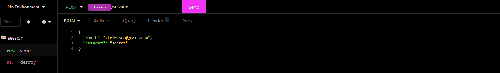
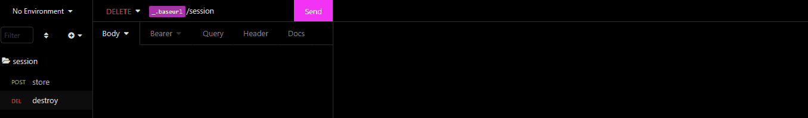

<h1 align="center">
    
    <p style="color:#000"> YOURPOSTS </p>
</h1>


<div style="margin-top: -50px" >
	<h3 align="center">Create and share your posts</h3>    
</div>

<p align='center'><a href="https://github.com/clefersondannylo/Api-blog--AdonisJS/blob/main/LICENSE"></a></p> 

<h4 align="center">  Status:In progress</h4>

<p align='center'><a style='text-decoration: none;color: #0085ff' href='#about' > About</a> • <a style='text-decoration: none;color: #0085ff' href='#features' > Features </a>•<a style='text-decoration: none;color: #0085ff' href='#gifs' > Gifs</a> • <a style='text-decoration: none;color: #0085ff' href='#how-it-works' > How it works</a> • <a style='text-decoration: none;color: #0085ff' href='#tech-stack' > Tech Stack</a> • <a style='text-decoration: none;color: #0085ff' href='#author' > Author</a> • <a style='text-decoration: none;color: #0085ff' href='#license' > License</a> </p>

## About

An application that allows you to write posts and articles on any topic, so they can be shared with your friends.

---

## Features

  - [x] Login
   - [x] Logout
   - [ ] Create a post
   - [ ] update a post
   - [ ] delete a post
   - [ ] share a post

---


## Gifs

<h1 align="center">
    <h4>
        Create Session
    </h4>
     
    <h4>
        Destroy Session
    </h4>
    
</h1>

---

## How it works

### Pre-requisites

Before you begin, you will need to have the following tools installed on your machine:
[Git](https://git-scm.com), [Node.js](https://nodejs.org/en/) , [PostgreSQL](https://www.postgresql.org/download/). In addition, it is good to have an editor to work with the code like [VSCode](https://code.visualstudio.com/)

#### Running the server

```bash
# Clone this repository
$ git@github.com:clefersondannylo/Api-blog--AdonisJS.git

# Access the project folder cmd/terminal
$ cd Api-blog--AdonisJS

# install the dependencies
$ npm install

# open pgAdmin 4 to create the Database

# click on 'servers' and create a new database named 'yourposts'

# copy everything from the '.env.example' file, and paste it into the '.env' file.

# Replace the value of the 'PG_USER', 'PG_PASSWORD' and 'PG_DB_NAME' fields with the data from the Postgres Database you created

# Run the application
$ node ace serve --watch

# The server will start at port: 3333 - go to http://localhost:3333

```

---

## Tech Stack

The following tools were used in the construction of the project:

#### **Server** ([AdonisJS](https://adonisjs.com/) + [TypeScript](https://www.typescriptlang.org/)) 

> See the file [package.json](https://github.com/clefersondannylo/Api-blog--AdonisJS/blob/main/package.json)

#### **Utilities**

- Editor:  **[Visual Studio Code](https://code.visualstudio.com/)**

- Markdown:  **[Typora](https://typora.io/)**

- API Test:  **[Insomnia](https://insomnia.rest/)**

---

## Author


[](https://www.linkedin.com/in/clefersondannylo/)[](mailto:clefersonnascimento8@gmail.com)


## How to contribute

1. Fork the project.
2. Create a new branch with your changes: `git checkout -b my-feature`
3. Save your changes and create a commit message telling you what you did: `git commit -m" feature: My new feature "`
4. Submit your changes: `git push origin my-feature`

---

## License

This project is under the license [MIT](./LICENSE).

Made by Cleferson Dannylo. [Get in touch!](https://www.linkedin.com/in/clefersondannylo/)

---

